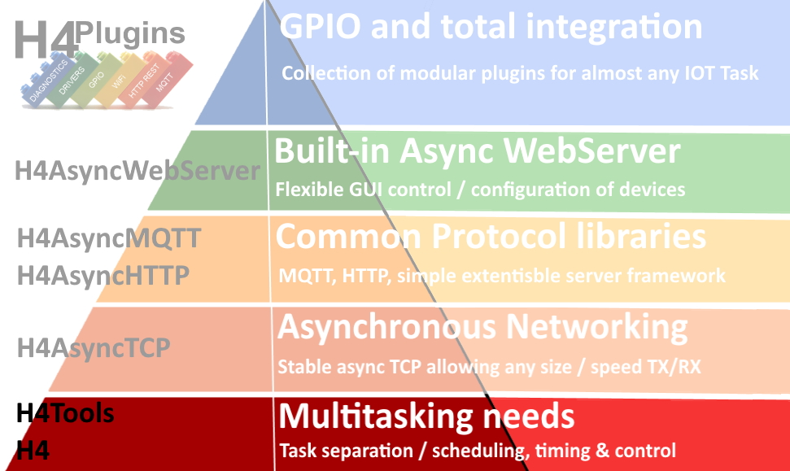
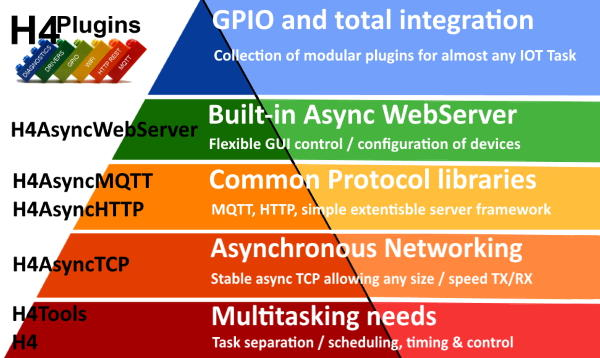
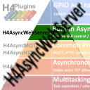

# H4Tools

## ArduinoIDE library of utility functions required by other H4 libraries

## Version 0.0.4 (20/10/2021)

Overload of `replaceParams` added

[Release Notes](docs/relnotes.md)

---

Licence:  Creative Commons: Attribution-NonCommercial-ShareAlike 4.0 International (CC BY-NC-SA 4.0) [Legal Text](https://creativecommons.org/licenses/by-nc-sa/4.0/legalcode)

# ***N.B. This licence expressly prohibits commercial use***

---

## If you are able, please [Support me on Patreon](https://patreon.com/esparto) or [PayPal](https://www.paypal.com/paypalme/h4plugins) and/or subscribe to my [Youtube channel (instructional videos)](https://www.youtube.com/channel/UCYi-Ko76_3p9hBUtleZRY6g)

---

# Contents

* [What does it do?](#what-does-it-do)
* [Where does it fit in "The IOT hierarchy of needs"?](#the-iot-hierarchy-of-needs)
* [Prerequisites](#prerequisites)
* [Installation](#installation)
* [Raising Issues](#issues)
* [API](#api)

---

# What does it do?

H4Tools contains common functions used by all other H4xxx libraries. Together, they provide for simple, *robust* and rapid ***asynchronous*** development if IOT apps on ESP8266 / ESP32.

Firstly H4Tools "smooths out" differences in the hardware of ESP8266 / ESP32 that make writing cross-platform code a lot simpler, faster and easier to debug. This type of thing is usually known as a "Hardware Abstraction Layer" or "HAL".

Secondly it provides a few utility functions of the kind that most programmers collect over the years and usually include / re-write them at the beginning of every project. I make no claims for any of the functions to be special or clever - they are just *my* quirky little way of doing things the way *I* like doing them. They have developed historically and also happen to be called by pretty much every piece of code I write, so - like 'em or not - you gotta have 'em! Finally, there are no doubt many different / better / faster ways of doing some of the tasks: If you think so, then you do them *your* way and spare me any advice, please :smile:

Perhaps the quickest explanation for this library is to show the *other libraries* that depend on it and where it sits in the grand scheme of rapid development of asynchronous multitasking apps on ESP8266 / ESP32:

---

# The "IOT Hierarchy of needs"



|| Name | Provides | Notes |
| :---: | :----------  | :--- | :--- |
||[H4](https://github.com/philbowles/H4)|Scheduler/Async Timers - core of all multitasking functions| |
||[H4Tools](https://github.com/philbowles/H4Tools)|'32/'8266 HAL and utility functions| :point_left: *YOU ARE HERE* |
||[H4AsyncTCP](https://github.com/philbowles/H4AsyncTCP)| Asynchronous TCP RX/TX| |
||[H4AsyncMQTT](https://github.com/philbowles/H4AsyncMQTT)| Asynchronous MQTT c/w auto-reconnect and *full* QoS0/1/2 | |
||[H4AsyncHTTP](https://github.com/philbowles/H4AsyncHTTP)| Asynchronous remote GET / POST etc | |
||[H4AsyncWebServer](https://github.com/philbowles/H4AsyncWebServer)| Asynchronous Web Server + fast webSockets + SSE| |
||[H4Plugins](https://github.com/philbowles/H4Plugins)| Fully-featured IOT Apps multitasking framework| |

---

# Prerequisites

The library has been tested using the following firmware. Please do not even *think* about raising anhy issues unless you have the following correctly installed.

* [ESP8266 core 3.0.2](https://github.com/esp8266/Arduino)
* [ESP32 core 2.0.0](https://github.com/espressif/arduino-esp32)
* [ArduinoIDE 1.8.16](https://www.arduino.cc/en/software)

***N.B.***

Note that PlatformIO is not in the above list. Many folk *do* use it, but you will need to create your own installation configuration.
I am currently in discussions to add a PIO install to the standard [H4 Installer](https://github.com/philbowles/h4installer). If you are able to help / contribute to this, please get in touch!

---

# Installation

Soon* all H4 libraries will use the [H4 Installer](https://github.com/philbowles/h4installer). This ensures that all versions match and that other additional special functions are included e.g. Addition of optimised board definitions in H4Plugins...

...Until that's ready, install this library manually by downloading the zip file and using the ArduinoIDE to "add zip library". (Luckily, it has no extra tasks that would require the full H4 installer)

* = Don't ask :) 

---

# Issues

## If you want a *quick* resolution, please follow these rules:

1. As with all H4xxx libraries, please make sure you have read *all* the relevant documentation relating to the issue and watched any videos on the [Youtube channel (instructional videos)](https://www.youtube.com/channel/UCYi-Ko76_3p9hBUtleZRY6g). Please also subscribe to the channel for notifications of news and updates.

2. If you still think there is a problem, then join the [Facebook H4  Support / Discussion](https://www.facebook.com/groups/444344099599131/) group and report the issue *briefly* there. This is because I visit the group every day, whereas I do not have time to visit dozens of github repos every day. Furthermore, it alerts other users to potential problems and allows a rapid initial assessment. 

3. If there is a genuine issue then you will be referred to [Raising H4/H4Plugins issues](https://github.com/philbowles/h4plugins/blob/master/docs/issues.md) after which you are advised to create a full github issue report.

4. Failing to make an initial report in the [Facebook H4  Support / Discussion](https://www.facebook.com/groups/444344099599131/) group and simply starting with a github issue, or failing to include all of the information required in [Raising H4/H4Plugins issues](https://github.com/philbowles/h4plugins/blob/master/docs/issues.md) is likely to result in a ***long*** delay before it gets picked up.

---

# API

```cpp
//
//  HAL
//
void        _HAL_analogFrequency(uint8_t pin,size_t f=H4T_PWM_DEFAULT);
void        _HAL_analogWrite(uint8_t pin, uint32_t value);
void        _HAL_attachAnalogPin(uint8_t pin);
void        _HAL_feedWatchdog(); // You should NEVER call this - it's here for completenesss  only
bool        _HAL_isAnalogInput(uint8_t p);
bool        _HAL_isAnalogOutput(uint8_t p);
uint32_t    _HAL_maxHeapBlock(); // Maxium size of available memory block that can be allocated from heap
string      _HAL_uniqueName(const string& prefix); // prefix defaults to "ESP8266" or "ESP32", appends unique H/W chip ID
/*
  General purpose / string manipulation
*/
using H4T_HEAP_LIMITS   = std::pair<size_t,size_t>;
using H4T_FILE_HANDLER  = std::function<void(const char*,size_t n)>;
using H4T_NVP_MAP       = std::unordered_map<std::string,std::string>;
using H4T_VS            = std::vector<std::string>;
using H4T_FN_RFC_START  = std::function<void(size_t)>;
using H4T_FN_RFC_CHUNK  = std::function<void(const uint8_t*,size_t)>;
using H4T_FN_RFC_END    = std::function<void(void)>;
using H4T_FN_LOOKUP     = std::function<std::string(const std::string&)>;
//
// While the functions here deal with valid json, they deal only with an extremely limited and specific subset.
//  This can save a LOT of space by avoiding external JSON libraries (e.g. ArduinoJson) where you have control over the input
//  (e.g. from your own internal webserver(s)) and cane ensure:
//  * No arrays
//  * no nesting
//  * no extraneous whitespace
//  * no unquoted values (everything is going to/from std::map<std::string,std::string>
//
// Example:
//  {"name":"phil","firmware":"H4","numeric","666"}
//
void                    dumphex(const uint8_t* mem, size_t len);
std::string             encodeUTF8(const std::string &);
H4T_HEAP_LIMITS         heapLimits();
uint32_t                hex2uint(const uint8_t* str);
std::string 		    join(const H4T_VS& vs,const char* delim="\n");
std::map<std::string,std::string> json2nvp(const std::string& s);
std::string             lowercase(std::string);
std::string             ltrim(const std::string& s, const char d=' ');
std::string             nvp2json(const std::map<std::string,std::string>& nvp);
std::string             readFile(const char* path);
void                    readFileChunks(const char* path,size_t chunk,H4T_FN_RFC_CHUNK fc,H4T_FN_RFC_START fs=nullptr,H4T_FN_RFC_END fe=nullptr);
std::string             replaceAll(const std::string& s,const std::string& f,const std::string& r);
std::string             replaceParams(const std::string& s,H4T_FN_LOOKUP f);
std::string             rtrim(const std::string& s, const char d=' ');
H4T_VS                  split(const std::string& s, const char* delimiter="\n");
std::string		        stringFromInt(int i,const char* fmt="%d");
bool		            stringIsAlpha(const std::string& s);
bool		            stringIsNumeric(const std::string& s);
std::string             trim(const std::string& s, const char d=' ');
std::string             uppercase(std::string);
std::string             urldecode(const std::string &s);
std::string             urlencode(const std::string &s);
size_t                  writeFile(const char* fn,const std::string& data,const char* mode="w");
//
template<typename T>
std::string flattenMap(const T& m,const std::string& fs=UNIT_SEPARATOR,const std::string& rs=RECORD_SEPARATOR,std::function<std::string(const std::string&)> f=[](const std::string& s){ return s; }){
    std::string flat;
    for(auto const& nvp:m) flat+=f(nvp.first)+fs+f(nvp.second)+rs;
    flat.pop_back();
    return flat;
}
```

## Why no example code?

1) The functions are small, simple and mostly obvious
2) There are dozens of example of usage littered throughout all of the other libraries and example code

---

(c) 2021 Phil Bowles h4plugins@gmail.com

* [Support me on Patreon](https://patreon.com/esparto)
* [Youtube channel (instructional videos)](https://www.youtube.com/channel/UCYi-Ko76_3p9hBUtleZRY6g)
* [Facebook H4 Support / Discussion](https://www.facebook.com/groups/444344099599131/)
* [Facebook General ESP8266 / ESP32](https://www.facebook.com/groups/2125820374390340/)
* [Facebook ESP8266 Programming Questions](https://www.facebook.com/groups/esp8266questions/)
* [Facebook ESP Developers (moderator)](https://www.facebook.com/groups/ESP8266/)